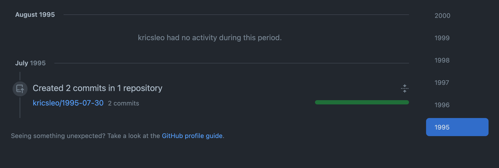

# Github Time Traveler

> Make your GitHub history back to 1990.

From [antfu/1990-script](https://github.com/antfu/1990-script), but allows you to travel to the day you wish.

<p align="center">
  
</p>

## Travel Back

1. [Create a repo](https://github.com/new) named the day you wish, like `1990-01-01`.
2. [Generate a personal access token](https://github.com/settings/tokens/new) on GitHub and copy it.
3. Run the following script.

```bash
sh -c "$(curl -fsSL https://raw.github.com/kricsleo/time-traveler-script/master/index.sh)"
```

Enter the day and your GitHub username and access token and then you are done :)
